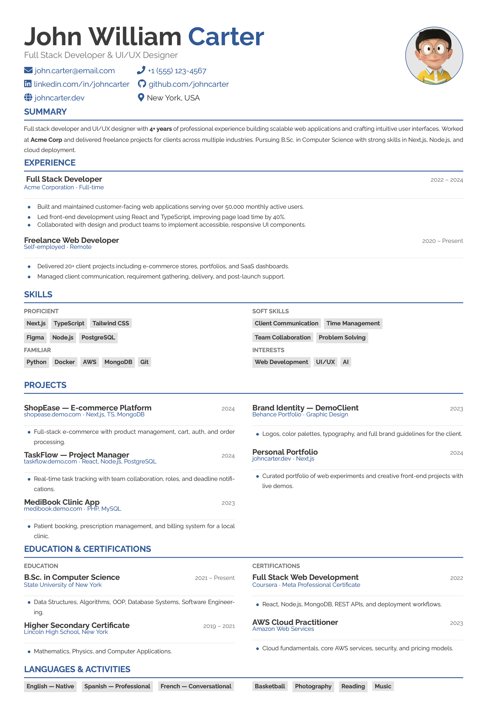

# Minimal Clean One-Page CV Template (LaTeX / Overleaf)

A clean, modern, and compact **one-page CV/resume template** built with **LaTeX** and optimized for **Overleaf**.  
Designed for students, developers, designers, and job seekers who want a professional-looking resume with minimal effort.

## Preview



> If the preview image does not show, upload a screenshot of your CV as `preview.png` in the root of this repository.

## Features

- Clean and minimal one-page layout
- Modern typography and balanced spacing
- Built with LaTeX
- Overleaf-friendly
- Easy to customize
- Suitable for developers, designers, and students
- Includes sections for:
  - Summary
  - Experience
  - Skills
  - Projects
  - Education
  - Certifications
  - Languages
  - Activities

## Files

- `main.tex` — main LaTeX source
- `photo.jpg` — profile photo placeholder
- `preview.png` — CV screenshot preview
- `sample-cv.pdf` — compiled sample PDF

## Live Demo

- [View Sample PDF](./sample-cv.pdf)
- [Open in Overleaf](https://www.overleaf.com/read/mwxmvvkjvynr#98f59d)

## How to Use

### Option 1 — Use with Overleaf
1. Open the Overleaf link above.
2. Copy the project to your own Overleaf account.
3. Replace the sample content with your own:
   - Name
   - Email
   - Phone
   - LinkedIn / GitHub / Portfolio links
   - Experience
   - Skills
   - Projects
   - Education
4. Replace `photo.jpg` with your own image if needed.
5. Compile and export as PDF.

### Option 2 — Compile Locally
Make sure you have a LaTeX distribution installed, such as:
- TeX Live
- MiKTeX

Then compile with:

```bash
pdflatex main.tex


Best Use Cases
This template is useful for:

Software developers
Web developers
Graphic designers
University students
Fresh graduates
Freelancers
Notes
This template is designed to stay compact and readable on a single page.
If your content becomes too long, reduce text or adjust spacing carefully.
For public sharing, remove personal/private information and use placeholder data.

**If needed, run it twice for proper alignment and links.
**
Author
Emamul Islam Nadid

Portfolio: einadid.vercel.app
GitHub: github.com/einadid
LinkedIn: linkedin.com/in/einadid